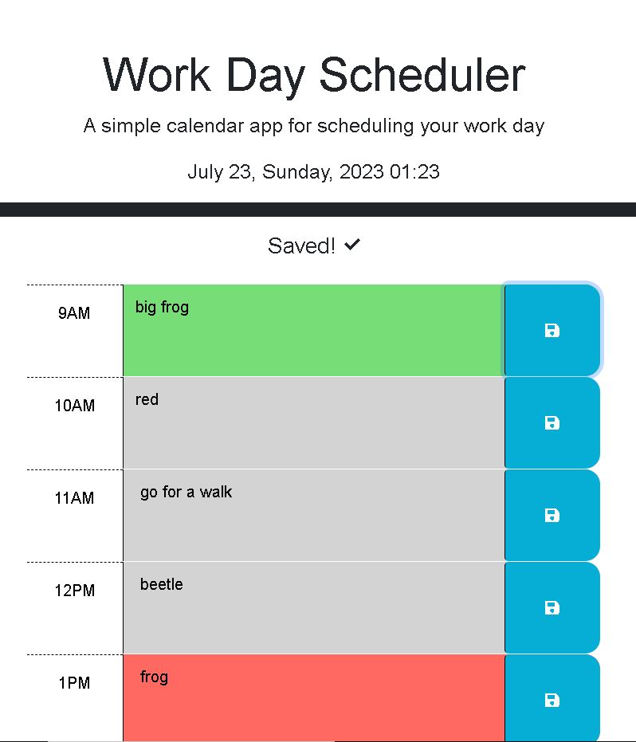

# Calendar

## Description

This is an application that helps you keep track of tasks by saving your tasks for the day in a simply daily calendar. I wanted to make this project to get more practice with JavaScript and jQuery. I also got to use some Bootstrap CSS to style the page. In order to get the current time, I used dayjs. The functionality of the project will help me and other users to keep track of what we have to do for the day and when to do it, so I like that this application is practical. I had fun making this simple calendar!

## Usage

To use this application, you can enter text in each hour slot, and then press the save button next to it to save that text. Some text reading "saved!" will appear at the top of the screen, alerting you that your text has been saved. If you want to update the text, you can delete your old text and save the new text, and it will update. You can refresh the page and your tasks will still be there!

The application also displays the date, and the hour sections will change color to be gray, red, or green if the hour is in the past, present, or future respectively.

Here is a link to the application:
[website link](https://breeprimmer.github.io/Calendar/)

## Credits

"$(document).ready()" from jQuery
http://learn.jquery.com/using-jquery-core/document-ready/

"Now" from Day.js
https://day.js.org/docs/en/parse/now

"Hour" from day.js
https://day.js.org/docs/en/get-set/hour

"How to get an array of attribute value from elements in a jQuery object" from stack overflow
https://stackoverflow.com/questions/9647968/how-to-get-an-array-of-attribute-value-from-elements-in-a-jquery-object

".each()" from jQuery
https://api.jquery.com/each/

"jQuery attr() method" from W3 Schools
https://www.w3schools.com/jquery/html_attr.asp

"jQuery.makeArray()" from jQuery
https://api.jquery.com/jquery.makearray/

"jQuery text() Method" from W3 Schools
https://www.w3schools.com/jquery/html_text.asp

"jQuery parent() Method" from W3 Schools
https://stackoverflow.com/questions/27842138/get-id-of-parent-element-on-click

"Get ID of parent element on click" from Stack Overflow
https://stackoverflow.com/questions/27842138/get-id-of-parent-element-on-click

"display:none; not working but visibility:hidden; does" fom Stack Overflow
https://stackoverflow.com/questions/57653704/displaynone-not-working-but-visibilityhidden-does

"How to apply !important using .css()?" from Stack Overflow
https://stackoverflow.com/questions/2655925/how-to-apply-important-using-css